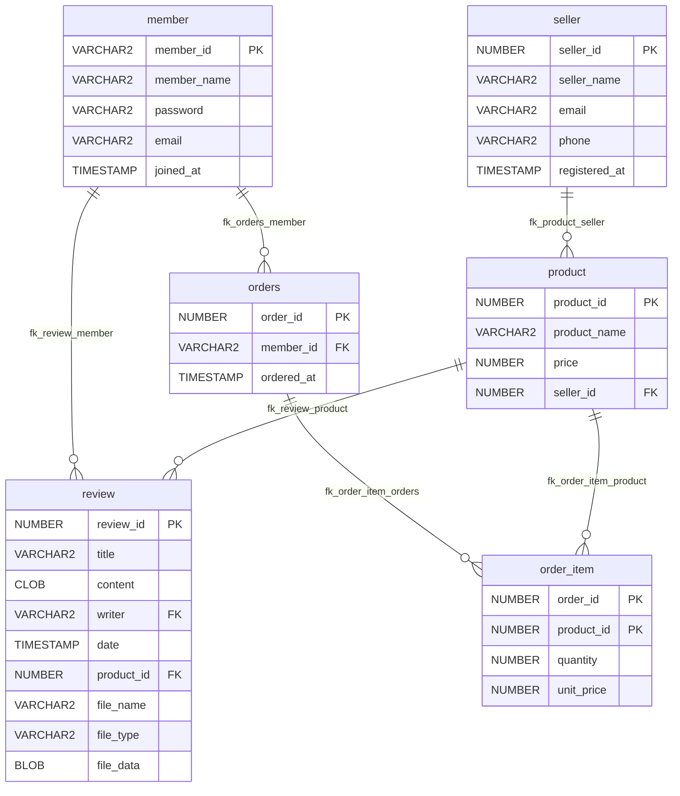

```mermaid
erDiagram
    review {
        NUMBER review_id PK
        VARCHAR2 title
        CLOB content
        VARCHAR2 writer FK
        TIMESTAMP date
        NUMBER product_id FK
        VARCHAR2 file_name
        VARCHAR2 file_type
        BLOB file_data
    }
    member {
        VARCHAR2 member_id PK
        VARCHAR2 member_name
        VARCHAR2 password
        VARCHAR2 email
        TIMESTAMP joined_at
    }
    order_item {
        NUMBER order_id PK
        NUMBER product_id PK
        NUMBER quantity
        NUMBER unit_price
    }
    orders {
        NUMBER order_id PK
        VARCHAR2 member_id FK
        TIMESTAMP ordered_at
    }
    product {
        NUMBER product_id PK
        VARCHAR2 product_name
        NUMBER price
        NUMBER seller_id FK
    }
    seller {
        NUMBER seller_id PK
        VARCHAR2 seller_name
        VARCHAR2 email
        VARCHAR2 phone
        TIMESTAMP registered_at
    }
    member ||--o{ review : fk_review_member
    product ||--o{ review : fk_review_product
    orders ||--o{ order_item : fk_order_item_orders
    product ||--o{ order_item : fk_order_item_product
    member ||--o{ orders : fk_orders_member
    seller ||--o{ product : fk_product_seller
```
